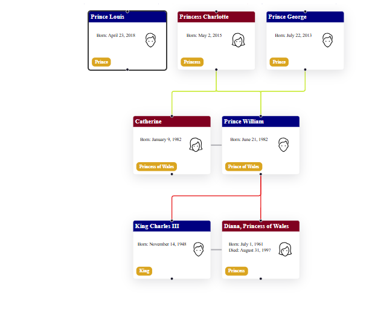

# React Flow Family Tree

This project is a React component library for creating family trees using [React flow](https://github.com/xyflow/xyflow).



[Sample Family Tree Data JSON](src/test/family.json)

---

## Features

1. The Family Tree **automatically arranges** families based on with inner family advantages.
2. **Support for Complex Couples** - Handle complex family structures such as divorces, shared kids, and other intricate relationships.
3. **Maintained Generations** - Generations are visually maintained, providing a clear distinction between different family layers.
4. **Color-Coded Family Edges** - Each family edge is assigned a unique color, helping you distinguish between different branches of your family.
5. **Non-Colliding Edges with Offset** - To enhance the clarity of your family tree, edges are arranged to avoid collisions.
6. **Portrait Image support** - Include images to personalize your family tree.
7. Very configurable

## Installation

1. To install the library, use npm or pnpm:

```bash
npm i reactflow-family-tree
pnpm add reactflow-family-tree
```

## Usage

1. Here is a basic example of how to use the `reactflow-family-tree` component:

```tsx
import React from 'react'
import FamilyTree from 'reactflow-family-tree'

const App = () => {
  const familyData = {
    familyMembers: [
      { id: '1', name: 'John Doe', gender: 'male', image: 'path/to/image1.jpg' },
      { id: '2', name: 'Jane Smith', gender: 'female', image: 'path/to/image2.jpg' },
      { id: '3', name: 'Alice Doe', gender: 'female', image: 'path/to/image3.jpg' },
      { id: '4', name: 'Bob Doe', gender: 'male', image: 'path/to/image4.jpg' },
    ],
    familyRelations: [
      { source: '1', target: '2', type: 'married' },
      { source: '1', target: '3', type: 'parent' },
      { source: '2', target: '3', type: 'parent' },
      { source: '1', target: '4', type: 'parent' },
      { source: '2', target: '4', type: 'parent' },
    ],
  }

  return <FamilyTree data={familyData} />
}

export default App
```

## Getting Started for Development

1. Clone the repository:

```bash
git clone https://github.com/harrykhh/react-flow-family-tree.git
```

2. Install dependencies:

```bash
cd family-tree-react-flow
pnpm install
```

Start the development server (using vite):

```bash
pnpm dev
```

## Contributing

If you find issues or have suggestions for improvements, please open an issue or submit a pull request. Your contributions are highly valued!

## License

This project is licensed under the MIT License - see the LICENSE.md file for details.

Happy family tree mapping! 🌳
